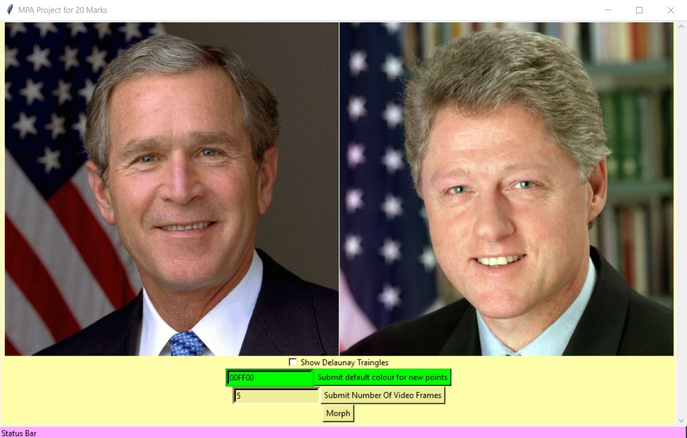
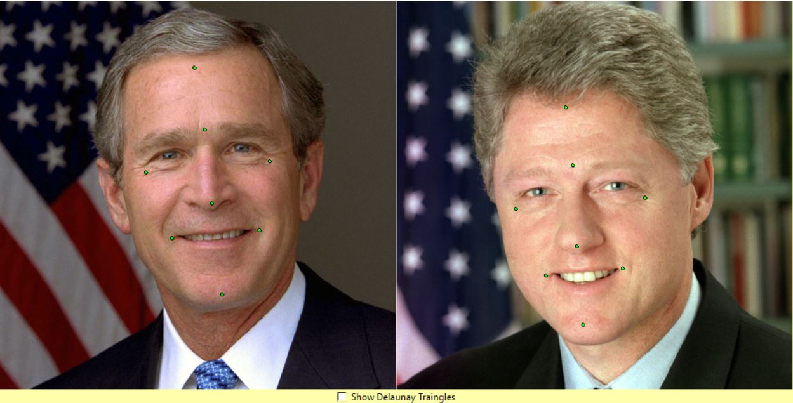
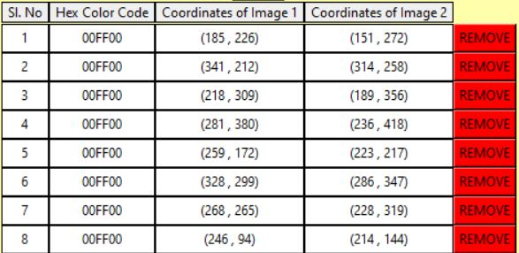
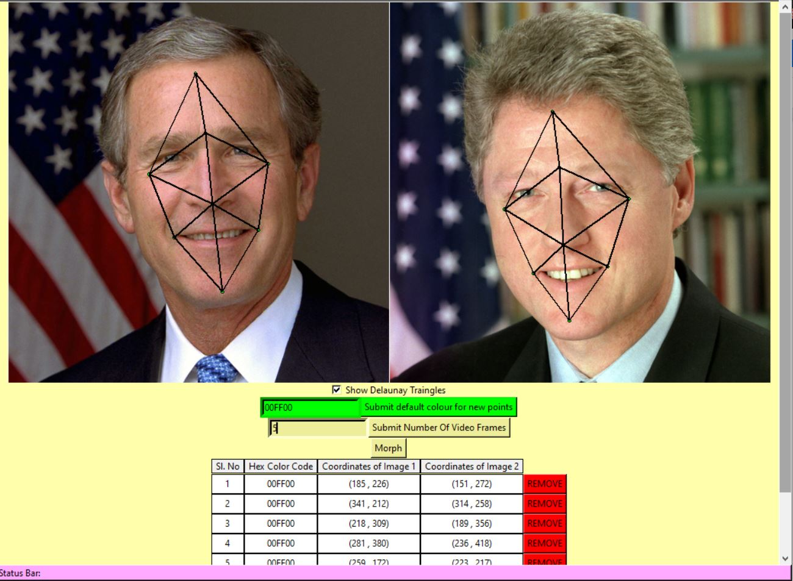
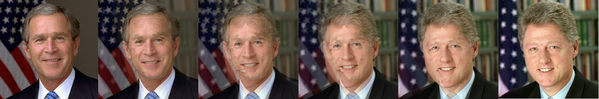
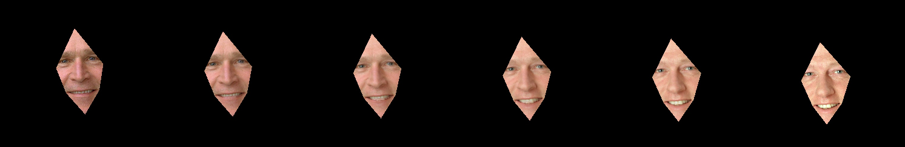

# Image-Morphing-Software

The Software takes input of two images of the same size and morphs one image into another. 
This is done using a GUI. The GUI is used to mark control points on both the images. 
Delaunay Triangulation is applied on the points selected. 
The triangles thus formed are warped using Affine Transformation. 
Finally, a set of intermediate images are obtained that show one image being morphed into the other image.

NOTE: The GUI, The Delaunay Triangulation, The Affine Transform have all been created indigenously, non of the OpenCV libraries have been used to simulate their funcionalities.

## The Working of the Software

The initial view of the GUI

Feature Points Marked

Table for Feature Points present on GUI

Corresponding Delaunay Triangles mapped for given feature points

After clicking the morph button, the status of morphing can be seen here

Intermediate images with background

Intermediate images without background

## Contributor - Abhay Aravinda [Email](17ucs002@lnmiit.ac.in)
